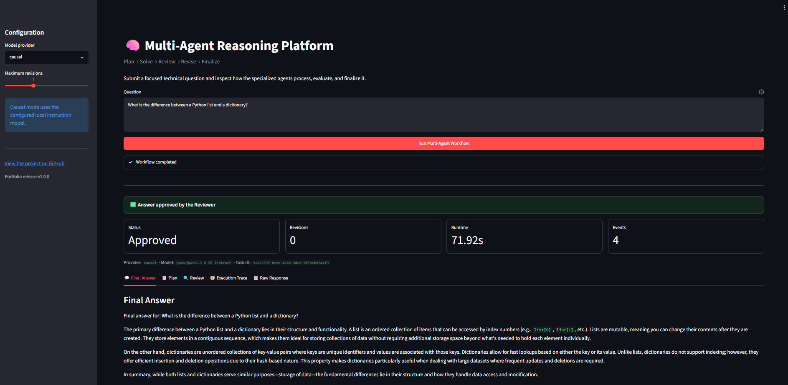
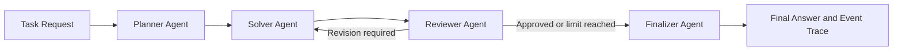

# Multi-Agent Reasoning Platform

[](https://github.com/alongholyalone-hue/multi-agent-reasoning-platform/actions/workflows/tests.yml)


A traceable multi-agent system for planning, solving, reviewing, revising, and evaluating technical answers.

The platform coordinates specialized AI agents through a typed workflow. It supports deterministic testing, local Hugging Face language models, bounded revision loops, safe refusal, workflow tracing, and independent rubric-based evaluation.

## Interactive Interface

The project includes a Streamlit interface for submitting questions and inspecting the complete multi-agent workflow.



The interface presents:

- The generated final answer
- Reviewer approval or safe-refusal status
- Runtime and revision count
- The Planner’s reasoning steps
- Reviewer issues and revision instructions
- A chronological agent execution trace
- The complete structured response

## Why This Project Exists

Language models can produce answers that sound convincing while being incomplete, contradictory, or factually incorrect.

This project explores how a structured multi-agent workflow can reduce those risks through:

- Separate planning, solving, reviewing, and finalization stages
- Deterministic quality and safety checks
- Optional model-based semantic review
- Bounded revision loops
- Safe refusal when an answer remains unreliable
- Complete workflow event traces
- Independent rubric-based benchmark scoring

## Architecture



## Agents

| Agent | Responsibility |
|---|---|
| Planner | Converts the question into an objective and ordered reasoning steps |
| Solver | Produces a draft answer using the configured model provider |
| Reviewer | Applies deterministic checks and optional semantic review |
| Finalizer | Returns an approved answer or a safe refusal |

## Main Features

- Interactive Streamlit interface
- FastAPI backend with automatic Swagger documentation
- Typed Pydantic request and workflow models
- Planner, Solver, Reviewer, and Finalizer agents
- Deterministic scaffold provider for development and testing
- Hugging Face sequence-to-sequence model support
- Hugging Face causal language-model support
- Bounded solver-review revision cycles
- Directional contradiction detection
- Truncated-answer detection
- Placeholder and minimum-completeness checks
- Semantic-review response validation
- Safe refusal for unresolved answers
- Chronological agent execution traces
- Repeatable provider evaluation CLI
- Rubric-based benchmark scoring
- Reviewer false-positive measurement
- Automated pytest suite
- GitHub Actions continuous integration

## Project Structure

```text
app/
├── agents/          Planner, Solver, Reviewer, and Finalizer
├── api/             FastAPI task routes
├── core/            Workflow orchestration and runtime configuration
├── evaluation/      Benchmark cases, scoring, and evaluation runner
├── models/          Typed request and workflow models
├── providers/       Deterministic and Hugging Face providers
├── tools/           Extension point for future tool integrations
└── main.py          FastAPI application

streamlit_app.py     Interactive user-facing workflow interface

docs/
└── images/          Interface screenshots

scripts/
└── evaluate_provider.py

tests/
└── Unit, integration, provider, API, and evaluation tests
```

## Installation

Clone the repository:

```bash
git clone https://github.com/alongholyalone-hue/multi-agent-reasoning-platform.git
cd multi-agent-reasoning-platform
```

Create and activate a virtual environment:

```bash
python -m venv .venv
source .venv/bin/activate
```

On Windows:

```bash
.venv\Scripts\activate
```

Install the dependencies:

```bash
python -m pip install --upgrade pip
pip install -r requirements.txt
```

## Running the Streamlit Interface

### Scaffold mode

Scaffold mode starts quickly and demonstrates the complete workflow, but it does not generate genuine model answers.

```bash
MODEL_PROVIDER=scaffold streamlit run streamlit_app.py
```

### Local causal model

```bash
export MODEL_PROVIDER=causal
export CAUSAL_MODEL_NAME=Qwen/Qwen2.5-0.5B-Instruct
export CAUSAL_MAX_NEW_TOKENS=256
export CAUSAL_DEVICE=-1

streamlit run streamlit_app.py
```

Then open:

```text
http://localhost:8501
```

A device value of `-1` uses the CPU. Initial model loading and generation may take several minutes on limited hardware.

## Running the FastAPI Backend

Start the API in scaffold mode:

```bash
MODEL_PROVIDER=scaffold uvicorn app.main:app --reload
```

The API will be available at:

```text
http://127.0.0.1:8000
```

Interactive Swagger documentation:

```text
http://127.0.0.1:8000/docs
```

Health check:

```bash
curl http://127.0.0.1:8000/health
```

## Solving a Task Through the API

Send a request to `POST /tasks/solve`:

```bash
curl -X POST \
  http://127.0.0.1:8000/tasks/solve \
  -H "Content-Type: application/json" \
  -d '{
    "question": "What is an API, and how does a client communicate with a server?",
    "max_revisions": 1
  }'
```

The response includes:

- A unique task identifier
- The final answer
- The Planner’s structured plan
- Reviewer approval and unresolved issues
- Revision instructions
- Revision count
- A chronological agent execution trace
- Workflow completion status

## Model Providers

### Scaffold Provider

Used for fast, deterministic development and automated testing:

```bash
export MODEL_PROVIDER=scaffold
```

The scaffold provider verifies the workflow but does not produce a genuine answer.

### Hugging Face Sequence-to-Sequence Provider

Example configuration:

```bash
export MODEL_PROVIDER=huggingface
export HF_MODEL_NAME=google/flan-t5-small
export HF_MAX_NEW_TOKENS=256
export HF_DEVICE=-1
```

### Hugging Face Causal Provider

Example configuration:

```bash
export MODEL_PROVIDER=causal
export CAUSAL_MODEL_NAME=Qwen/Qwen2.5-0.5B-Instruct
export CAUSAL_MAX_NEW_TOKENS=256
export CAUSAL_DEVICE=-1
```

## Reviewer Checks

Before an answer can be approved, the Reviewer can evaluate:

- Minimum answer length
- Minimum number of complete sentences
- Number of reasoning steps
- Placeholder or unfinished text
- Missing requested tools
- Mid-sentence truncation
- Directional contradictions
- Semantic correctness and logical coherence
- Validity of the semantic reviewer’s JSON response
- Consistency between approval and revision instructions

If an answer fails review, the Solver may revise it until the configured revision limit is reached.

If the answer still fails, the Finalizer returns a safe refusal instead of presenting the unreliable draft as correct.

## Provider Evaluation

Run the five-case benchmark with the scaffold provider:

```bash
python -m scripts.evaluate_provider \
  --provider scaffold
```

Run it with the causal provider:

```bash
python -m scripts.evaluate_provider \
  --provider causal \
  --output artifacts/qwen_evaluation.json
```

Limit the run to a smaller number of cases:

```bash
python -m scripts.evaluate_provider \
  --provider causal \
  --limit 1
```

Evaluation reports include:

- Reviewer approval rate
- Independent rubric benchmark pass rate
- Reviewer false-positive count
- Runtime per case
- Revision count
- Missing required concepts
- Matched forbidden claims
- Final answers
- Review issues
- Agent event count

Generated reports are stored under `artifacts/` and excluded from Git.

## Diagnostic Benchmark Result

A five-case CPU evaluation was conducted with:

```text
Model: Qwen/Qwen2.5-0.5B-Instruct
Maximum new tokens: 160
Maximum revisions per case: 1
```

| Metric | Result |
|---|---:|
| Cases | 5 |
| Reviewer approvals | 2/5 |
| Rubric benchmark passes | 0/5 |
| Reviewer false positives | 2 |
| Total revisions | 4 |
| Average runtime | 62.10 seconds |

The deterministic Reviewer rejected three unreliable outputs, including contradictory and truncated answers.

However, two answers were approved while still failing their independent benchmark rubrics. This demonstrates why internal model approval and ground-truth-oriented evaluation must be measured separately.

The benchmark also revealed an important limitation: using the same small model to generate and review an answer does not guarantee factual reliability.

This is a small diagnostic benchmark and should not be interpreted as a general measurement of the model’s overall capabilities.

## Running Tests

Run the complete test suite in scaffold mode:

```bash
MODEL_PROVIDER=scaffold python -m pytest -q
```

The tests cover:

- Planner behavior
- Solver behavior
- Reviewer behavior
- Finalizer behavior
- Workflow orchestration
- Revision limits
- Safe finalization
- API validation
- Provider configuration
- Local-model adapters
- Semantic-review parsing
- Contradiction detection
- Truncation detection
- Evaluation summaries
- Rubric-based benchmark scoring
- Reviewer false-positive reporting

GitHub Actions automatically runs the test suite after pushes to `main` and on pull requests.

## Reliability Design

The platform is designed to fail safely.

When an answer does not pass review within the allowed revision limit, the Finalizer does not present the unreliable draft as a valid answer. Instead, it returns a safe refusal and preserves the unresolved review issues in the workflow result.

This design prioritizes transparency over confidently returning a potentially incorrect response.

## Current Limitations

- Small local models may produce shallow, incomplete, or factually incorrect answers.
- Semantic review is less reliable when the same model generates and reviews.
- Deterministic rubrics depend on explicitly defined concepts and phrases.
- Rubric matching does not yet measure paraphrases through semantic similarity.
- CPU inference is relatively slow.
- The current diagnostic benchmark contains only five cases.
- External search, retrieval, and calculation tools are not yet connected.
- The Streamlit interface currently runs locally rather than through a permanent hosted deployment.

## Future Improvements

- Use separate generator and reviewer models
- Add retrieval-augmented generation
- Add calculator and research tools
- Expand the benchmark dataset
- Add semantic-similarity scoring
- Record token usage and detailed model latency
- Add persistent workflow and conversation history
- Add downloadable evaluation reports
- Deploy a publicly accessible demonstration
- Add authentication and usage limits for hosted deployment

## Status

Version 1.1.0 adds an interactive Streamlit interface to the existing multi-agent workflow, local-model integrations, safety checks, evaluation system, FastAPI backend, automated tests, and continuous integration.