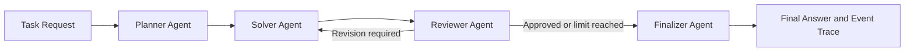

# Multi-Agent Reasoning Platform

A traceable multi-agent system for planning, solving, reviewing, revising, and evaluating technical answers.

The platform coordinates specialized AI agents through a typed workflow. It supports deterministic testing and local Hugging Face language models.

## Why This Project Exists

Language models can produce answers that sound convincing while being incomplete, contradictory, or factually incorrect.

This project reduces those risks through:

- Separate planning, solving, reviewing, and finalization stages
- Deterministic quality checks
- Optional semantic review
- Bounded revision loops
- Safe refusal when an answer remains unreliable
- Complete workflow event traces
- Independent rubric-based benchmark scoring

## Architecture



## Agents

| Agent | Responsibility |
|---|---|
| Planner | Converts the question into an objective and reasoning steps |
| Solver | Produces an answer using the configured model provider |
| Reviewer | Applies deterministic and semantic quality checks |
| Finalizer | Returns an approved answer or a safe refusal |

## Main Features

- FastAPI backend
- Typed Pydantic workflow models
- Planner, Solver, Reviewer, and Finalizer agents
- Deterministic scaffold provider
- Hugging Face sequence-to-sequence provider
- Hugging Face causal model provider
- Bounded solver-review revision cycles
- Directional contradiction detection
- Truncated-answer detection
- Placeholder and completeness checks
- Semantic review validation
- Safe refusal for unresolved answers
- Chronological agent-event traces
- Provider evaluation CLI
- Rubric-based benchmark scoring
- Automated pytest suite

## Project Structure

```text
app/
├── agents/          Planner, Solver, Reviewer, and Finalizer
├── api/             FastAPI routes
├── core/            Workflow orchestration and runtime configuration
├── evaluation/      Benchmark cases, scoring, and evaluation runner
├── models/          Typed request and workflow models
├── providers/       Deterministic and Hugging Face providers
├── tools/           Extension point for future tools
└── main.py          FastAPI application

scripts/
└── evaluate_provider.py

tests/
└── Unit, integration, provider, API, and evaluation tests
```

## Installation

Clone the repository:

```bash
git clone https://github.com/alongholyalone-hue/multi-agent-reasoning-platform.git
cd multi-agent-reasoning-platform
```

Create a virtual environment:

```bash
python -m venv .venv
source .venv/bin/activate
```

Install dependencies:

```bash
python -m pip install --upgrade pip
pip install -r requirements.txt
```

## Running the API

Run the application in scaffold mode:

```bash
MODEL_PROVIDER=scaffold uvicorn app.main:app --reload
```

Open the interactive API documentation:

```text
http://127.0.0.1:8000/docs
```

Check the health endpoint:

```bash
curl http://127.0.0.1:8000/health
```

## Solving a Task

Send a request to `POST /tasks/solve`:

```bash
curl -X POST \
  http://127.0.0.1:8000/tasks/solve \
  -H "Content-Type: application/json" \
  -d '{
    "question": "Why does orbital velocity decrease as radius increases?",
    "max_revisions": 1
  }'
```

The response includes:

- A unique task identifier
- The final answer
- The Planner’s structured plan
- Reviewer approval and issues
- Revision count
- A chronological execution trace

## Model Providers

### Scaffold Provider

Used for fast and deterministic testing:

```bash
export MODEL_PROVIDER=scaffold
```

### Hugging Face Sequence-to-Sequence Provider

```bash
export MODEL_PROVIDER=huggingface
export HF_MODEL_NAME=google/flan-t5-small
export HF_MAX_NEW_TOKENS=256
export HF_DEVICE=-1
```

### Hugging Face Causal Provider

```bash
export MODEL_PROVIDER=causal
export CAUSAL_MODEL_NAME=Qwen/Qwen2.5-0.5B-Instruct
export CAUSAL_MAX_NEW_TOKENS=160
export CAUSAL_DEVICE=-1
```

A device value of `-1` uses the CPU.

## Provider Evaluation

Run the five-case benchmark with the scaffold provider:

```bash
python -m scripts.evaluate_provider \
  --provider scaffold
```

Run it with the causal provider:

```bash
python -m scripts.evaluate_provider \
  --provider causal \
  --output artifacts/qwen_evaluation.json
```

Evaluation reports include:

- Reviewer approval rate
- Rubric benchmark pass rate
- Reviewer false-positive count
- Runtime per case
- Revision count
- Missing required concepts
- Matched forbidden claims
- Final answers and review issues

Generated reports are stored under `artifacts/` and excluded from Git.

## Diagnostic Benchmark Result

A five-case CPU evaluation was run with:

```text
Model: Qwen/Qwen2.5-0.5B-Instruct
Maximum new tokens: 160
Maximum revisions per case: 1
```

| Metric | Result |
|---|---:|
| Cases | 5 |
| Reviewer approvals | 2/5 |
| Rubric benchmark passes | 0/5 |
| Reviewer false positives | 2 |
| Total revisions | 4 |
| Average runtime | 62.10 seconds |

The deterministic Reviewer rejected three unreliable outputs, including contradictory and truncated answers.

Two answers were still approved while failing their independent benchmark rubrics. This demonstrates why reviewer approval and ground-truth-oriented evaluation should be measured separately.

This is a small diagnostic benchmark and is not a general measurement of the model’s overall capabilities.

## Running Tests

Run the complete test suite:

```bash
MODEL_PROVIDER=scaffold python -m pytest -q
```

The tests cover:

- Agent behavior
- Workflow orchestration
- Revision limits
- Safe finalization
- API validation
- Provider configuration
- Local-model adapters
- Semantic-review parsing
- Contradiction detection
- Truncation detection
- Evaluation summaries
- Rubric-based benchmark scoring

## Reliability Design

The platform is designed to fail safely.

When an answer does not pass review within the allowed revision limit, the Finalizer does not return the unreliable draft as a valid answer. It returns a safe refusal and preserves the unresolved review issues.

## Current Limitations

- Small local models may produce incorrect answers.
- Semantic review is less reliable when the same model generates and reviews.
- Rubrics depend on explicitly defined phrases and concepts.
- CPU inference is relatively slow.
- The current benchmark contains only five diagnostic cases.
- External search, retrieval, and calculation tools are not yet connected.

## Future Improvements

- Use separate generator and reviewer models
- Add retrieval-augmented generation
- Add calculator and research tools
- Expand the benchmark dataset
- Add semantic-similarity scoring
- Record token usage and detailed latency
- Add persistent workflow storage
- Build a web interface for inspecting workflow traces

## Status

The core multi-agent workflow, local model integrations, safety checks, evaluation system, API, and automated tests are complete.